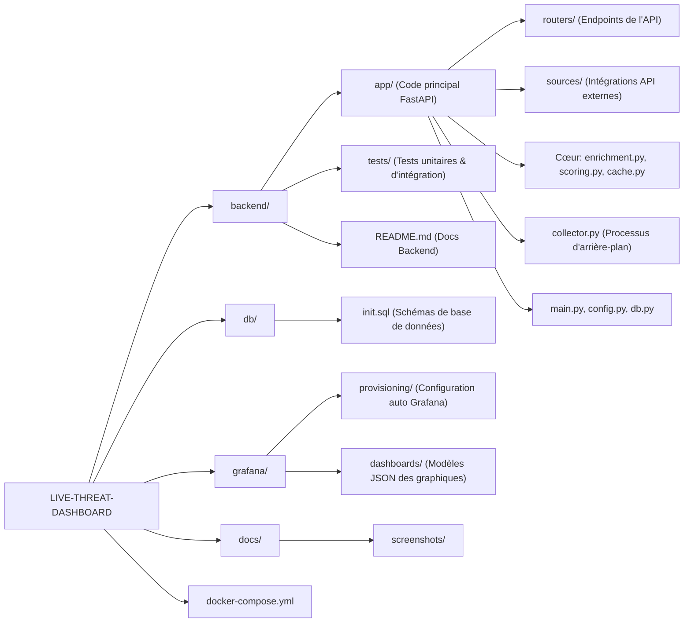
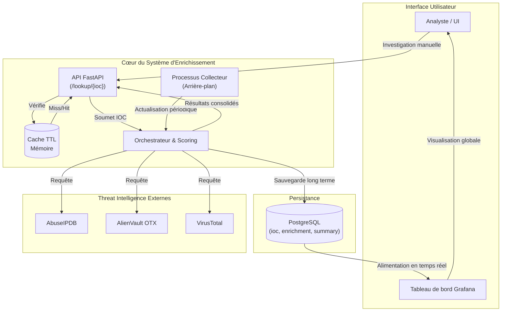

# Tableau de Bord des Menaces en Direct (Live Threat Dashboard)

Projet de tableau de bord de cybersécurité en temps réel développé avec Python, FastAPI, PostgreSQL et Grafana.

Le backend agrée des renseignements sur les menaces (Threat Intelligence) en provenance de :
- AbuseIPDB
- AlienVault OTX
- VirusTotal

Il normalise les résultats de ces sources, calcule un score de risque global et stocke les données d'enrichissement en temps réel pour une visualisation sur un tableau de bord.

---

## Le problème que cet outil résout

Les équipes de sécurité perdent souvent du temps à interroger manuellement plusieurs flux de renseignement sur les menaces pour chaque IOC (Indicateur de Compromission).
Cela entraîne des investigations lentes, des décisions de tri incohérentes et un manque de visibilité pour les managers.

Ce projet résout ce problème en :
- Agrégeant plusieurs flux au sein d'une seule API,
- Normalisant les résultats dans un schéma unique,
- Évaluant automatiquement le risque des IOC,
- Et exposant les métriques en temps réel dans Grafana pour une prise de décision rapide.

---

## Comment ça marche

1. Un IOC est soumis (via `/lookup/{ioc}` ou inséré dans la base de données pour le traitement par le collecteur).
2. L'orchestrateur d'enrichissement appelle AbuseIPDB, OTX et VirusTotal simultanément.
3. Les réponses des sources sont normalisées (`status`, `data`, `error`, `duration_ms`).
4. Un score de risque unifié et un niveau de risque sont calculés (`low|medium|high|critical`).
5. Les résultats sont mis en cache en mémoire (TTL) pour garantir la réactivité de l'API.
6. Le collecteur en direct écrit l'historique des enrichissements dans PostgreSQL.
7. Grafana lit `ioc_summary` et `enrichment` pour les tableaux de bord en temps réel.

---

## Technologies utilisées

- Python 3.11
- FastAPI + Uvicorn
- Requests + AnyIO (délais d'attente, tentatives, exécution asynchrone des threads)
- PostgreSQL (stockage des IOC, historique des enrichissements, table de résumé)
- Grafana (tableau de bord en direct et panneaux graphiques)
- Docker Compose (orchestration de l'API, base de données + Grafana)
- Pytest / unittest (tests de fonctionnement)

---

## Valeur ajoutée pour l'entreprise

- **Tri SOC plus rapide :** les analystes obtiennent une vue globale des risques au lieu d'utiliser 3 portails distincts.
- **Meilleure priorisation :** `risk_score` et `risk_level` rendent les files d'attente d'alertes directement exploitables.
- **Visibilité opérationnelle :** les managers peuvent suivre les tendances des IOC et les taux d'erreur des sources en temps réel.
- **Coût d'investigation réduit :** le cache + le collecteur réduisent les vérifications manuelles répétitives.
- **Processus auditable :** les données d'enrichissement historiques permettent de consolider les rapports d'incidents.

---

## Interface Web

Une fois la stack démarrée, ouvrez :
- `http://127.0.0.1:8000/`

Fonctionnalités de l'interface utilisateur (UI) :
- Entrée de l'IOC (IP/domaine/URL/hash)
- Bouton de débogage pour afficher les données brutes (`raw_json`)
- Cartes de résumé (`risk_score`, `risk_level`, catégories)
- Cartes par source (statut, score, durée, erreurs)
- Visionneuse complète des résultats JSON

**Capture d'écran de l'interface utilisateur :**


---

## Tableau de Bord (Grafana)

Le tableau de bord de supervision globale en direct est disponible ici :
- `http://127.0.0.1:3000/`

**Capture d'écran du Tableau de Bord :**


---

## Vidéo de Démonstration

Regardez la démonstration du projet sur YouTube :
- [Vidéo de démonstration du Dashboard en Direct](https://youtu.be/pGHL-kM1FlE)

---

## Organisation du Projet

L'organisation du projet respecte les principes de séparation des responsabilités. Le backend est découplé de la base de données et de la visualisation (Grafana). La logique applicative (FastAPI) est divisée en routeurs, sources d'intelligence externes et composants métier centraux.



### Rôles des principaux dossiers :
- `backend/app/sources/` : Contient les connecteurs spécifiques pour chaque API (AbuseIPDB, OTX, VirusTotal). Facilement extensible pour ajouter de nouvelles sources.
- `backend/app/routers/` : Les points d'entrée de l'API REST (`/health`, `/lookup/{ioc}`).
- `backend/app/[enrichment|scoring].py` : Le cœur métier. Ordonnance les appels aux sources et unifie les résultats pour calculer un score global de dangerosité.
- `grafana/provisioning/` : Automatise la configuration de Grafana pour qu'il se connecte directement à PostgreSQL et charge les tableaux de bord dès le démarrage avec Docker.

---

## Architecture et Flux de Données

Ce système est conçu avec un **Orchestrateur asynchrone** capable de gérer l'enrichissement manuel (par les utilisateurs via l'API) ou automatique (via un processus 'collector' en arrière-plan). Les requêtes API bénéficient d'un cache mémoire pour une lecture rapide, tandis que les opérations lourdes sont déléguées à la base de données PostgreSQL.



### Points clés de l'architecture :
1. **Haute Disponibilité :** Le processus de `collector` peut échouer sans impacter l'API REST FastAPI qui sert les utilisateurs en direct.
2. **Concurrence :** `app/enrichment.py` lance des requêtes asynchrones en parallèle vers AbuseIPDB, OTX, et VirusTotal (via `AnyIO`). Si l'une des API cible ralentie, les autres ne sont pas bloquées (système de timeout intégré).
3. **Mise en cache efficace :** Un cache en mémoire permet d'éviter l'épuisement des quotas d'API des services externes si le même IOC est interrogé plusieurs fois par minute.
4. **Schéma de données découplé :** La table `enrichment` stocke les retours bruts en format JSON (`raw_json`) pour ne jamais perdre de détail technique, tandis que la table `ioc_summary` expose des données simples et typées pour l'affichage Grafana.

---

## Tester le projet sur un PC (Windows + PowerShell)

Chemin du dépôt (exemple) :
`C:\Users\jamai\OneDrive\Desktop\live-threat-dashboard\live-threat-dashboard`

### 1) Démarrer la stack de conteneurs

Terminal 1 (PowerShell), depuis la racine du projet, exécutez les commandes suivantes :

```powershell
docker compose up -d --build
docker compose ps
```

### 2) Initialiser la base de données (Une seule fois)

Terminal 1, même chemin, appliquez le schéma SQL :

```powershell
Get-Content .\db\init.sql | docker exec -i threat_db psql -U threat -d threatdb
```

### 3) Lancer le processus de collecte en temps réel

Terminal 1, même chemin (à garder ouvert dans un coin) :

```powershell
docker exec -it threat_api python -m app.collector
```

### 4) Différences d'utilisation entre les interfaces

- **FastAPI UI (Investigation manuelle) :** `http://127.0.0.1:8000/`
  *Pensé pour auditer un seul IOC à la demande, consulter les détails techniques bruts fournis par chaque source.*
- **Grafana (Supervision globale) :** `http://127.0.0.1:3000/`
  *Pensé pour la gestion d'équipe et de centre de supervision. Observe les tendances temporelles, la répartition critique des menaces (Camemberts/Courbes) et les erreurs du système de collecte.*

### 5) Vérifier que le flux UI -> Grafana fonctionne

1. Allez sur l'UI Web (`http://127.0.0.1:8000/`), et cherchez un IOC (par exemple `https://www.google.com`).
2. Cet IOC est automatiquement injecté dans la base PostgreSQL par le routeur `/lookup/{ioc}`.
3. Le collecteur (`collector.py`) va identifier ce nouvel IOC, l'enrichir via l'orchestrateur et insérer le résultat dans `ioc_summary`.
4. Sur Grafana, après 5 à 10 secondes de rafraichissement automatique, l'IOC analysé ressort dans le tableau en bas.

Vérification optionnelle directement en base SQL (Terminal 2) :
```powershell
@'
SELECT id, type, value, created_at
FROM ioc
WHERE value = 'https://www.google.com'
ORDER BY id DESC
LIMIT 5;
'@ | docker exec -i threat_db psql -U threat -d threatdb
```

---

## Exécution et Test Rapide

Depuis la racine du projet :

1. `Copy-Item .env.example .env` et insérez vos clés d'API (VT, AbuseIPDB, OTX) dans `.env`.
2. `docker compose up -d --build`
3. `Get-Content .\db\init.sql | docker exec -i threat_db psql -U threat -d threatdb`
4. `docker exec -it threat_api python -m app.collector`
5. Ouvrez :
   - UI Web : `http://127.0.0.1:8000/`
   - Dashboards Grafana : `http://127.0.0.1:3000/`

Pour plus d'informations opérationnelles sur le SQL ou les tests backends, consultez la documentation spécifique :
- `backend/README.md`
